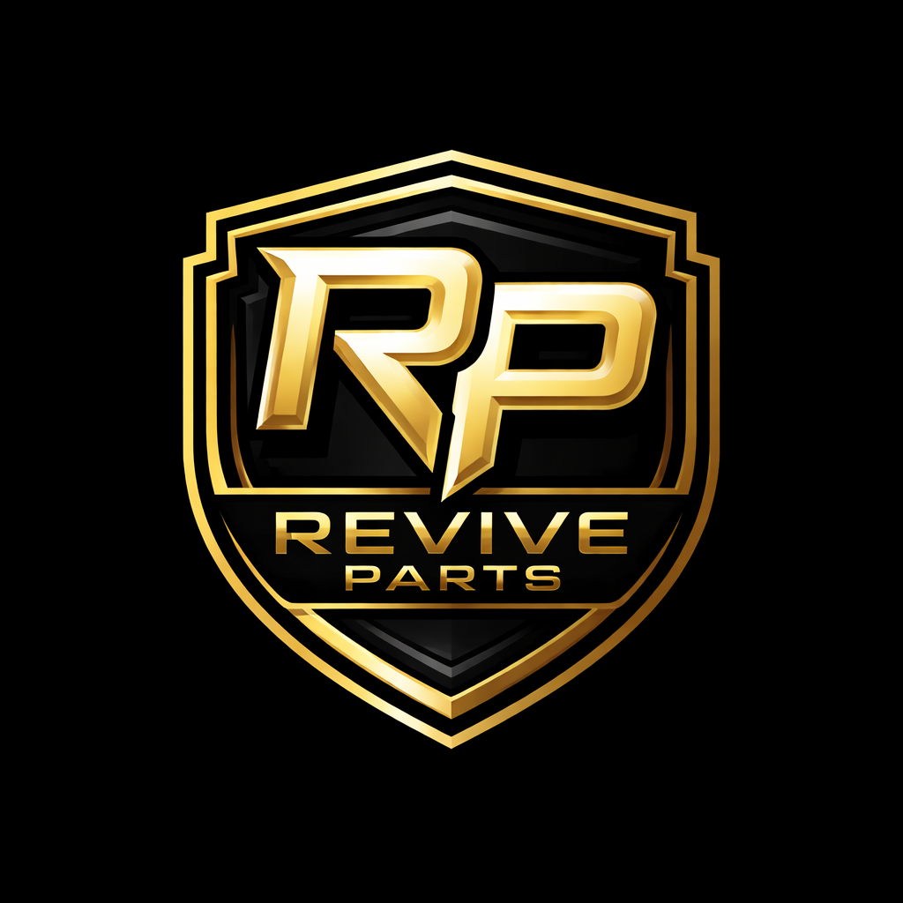

<div align="center">



# ReviveParts

**Inventário digital de peças automotivas — impressas em 3D, sob demanda.**


</div>

---

## ✦ Sobre

ReviveParts revive carros clássicos e veículos fora-de-linha imprimindo em 3D peças que **não existem mais no mercado**. O app conecta o cliente que precisa da peça a um catálogo digital + uma IA que reconhece a peça por foto e descrição, gera um modelo 3D para visualização e dispara um pedido de impressão sob demanda.

> **MVP atual:** uma única peça em destaque — a **Manivela de Vidro do VW Fusca**. A arquitetura já está pronta para escalar para todo o catálogo.

## ⚙️ Funcionalidades

### 👤 Cliente
- Cadastro/login local
- Catálogo de peças com pronta entrega (foto, preço, estoque, tempo de prototipagem)
- **Visualizador 3D** real (SceneView) na tela da peça
- **Busca por IA**: descreva ou fotografe a peça → reconhecimento → preview 3D → pedido
- Pagamento simulado por **Cartão** (validação Luhn) ou **PIX** (QR Code + copia-e-cola)
- Acompanhamento do pedido em tempo real: `Pedido feito → Em análise → Imprimindo → Embalando → Saiu para entrega → Entregue`
- Gestão de cartões salvos e perfil

### 🛠️ Dono
- Dashboard de pedidos filtrado por status
- Avanço manual do status (orquestração da fila de impressão)
- CRUD de produtos (foto, preço, estoque, tempo de prototipagem, modelo 3D)

## 🎨 Identidade visual

| Cor | Uso |
|---|---|
| `#FFD60A` | Amarelo primário — CTA, destaques |
| `#0A0A0A` | Preto — background |
| `#1A1A1A` | Surface |

Tema escuro permanente. Tipografia bold para impacto industrial.

## 🧱 Stack

- **Kotlin 2.2** + **Jetpack Compose** + **Material3**
- **Room** para persistência local
- **Navigation Compose** + ViewModel + StateFlow
- **SceneView** para renderização 3D real
- **CameraX** + **Coil** para captura/exibição de imagens
- **ZXing** para geração de QR PIX
- **DataStore** para sessão

Sem backend, sem APIs externas — tudo funciona offline para apresentação.

## 🚀 Rodando

```bash
git clone https://github.com/ictydiego/reviveparts.git
cd reviveparts
./gradlew :app:assembleDebug
```

Abra no Android Studio (Hedgehog+), rode em emulador API 26+.

### Credenciais seed

| Role | E-mail | Senha |
|---|---|---|
| Dono | `dono@reviveparts.com` | `dono123` |
| Cliente | *cadastre-se na tela inicial* | — |

## 🗺️ Fluxo principal

```
Cliente → Cadastro → Home (catálogo)
                       ↓
         ┌─────────────┴─────────────┐
         ↓                           ↓
     Detalhe peça              + (IA Search)
         ↓                           ↓
       Comprar      ←  reconhecimento + 3D
         ↓
      Pagamento (Cartão | PIX)
         ↓
      Pedido criado → status pipeline
                          ↑
                    Dono avança status
```

## 📂 Estrutura

```
app/src/main/java/br/unasp/reviveparts/
├── ui/         (theme, components, nav, screens por role)
├── data/       (Room db, repos, ai mock, payments)
├── domain/     (enums + models)
└── RevivePartsApp.kt
```

## 🧪 Testes

```bash
./gradlew :app:testDebugUnitTest
```
Cobertura: validação Luhn, transições de status, mock de IA.

## 📜 Licença

MIT.

---

<div align="center">
Made with ⚙️ + 🟡 by the ReviveParts team
</div>
